# Mini Project Statements

---

## Overview

This repository contains comprehensive mini projects demonstrating practical applications of Python and SQL technologies. Each project is designed as a standalone learning module with clear objectives, implementation guidelines, and expected outputs.

The projects focus on real-world scenarios including recruitment automation, healthcare data management, and business intelligence applications.

---

## Project Structure

```
Mini Project Statements/
│
├── python/
│   ├── main.py                          # Main execution file
│   ├── parser.py                        # File parsing module (PDF/TXT)
│   ├── matcher.py                       # Skill extraction and matching
│   ├── skills.py                        # Predefined skill database
│   ├── suggestions.py                   # Recommendation engine
│   ├── requirements.txt                 # Python dependencies
│   ├── README.md                        # Project-specific documentation
│   ├── job_desc/                        # Job description samples
│   │   └── sample_job_description.txt
│   ├── resumes/                         # Resume samples (PDF format)
│   └── outputs/                         # Generated analysis results
│       └── result.png
│
├── sql/
│   ├── hospital_management_analysis.sql # Database and query script
│   ├── README.md                        # Project-specific documentation
│   └── outputs/                         # Query execution screenshots
│       ├── Patient_table.png
│       ├── doctors_table.png
│       ├── appointments_table.png
│       ├── treatments_table.png
│       ├── Most_consulted_doctors.png
│       ├── doctor_peformance_analysis.png
│       ├── monthly_revenue.png
│       ├── total_revenue.png
│       ├── common_disease.png
│       └── patient_visit_freq.png
│
└── README.md                            # This file

```

---

## Python Project - Resume Analyzer

### Project Overview

A sophisticated Python-based Resume Analyzer that evaluates candidate resumes against job descriptions. The system extracts relevant skills, performs intelligent matching, calculates compatibility scores, and provides actionable recommendations for resume improvement.

**Use Case:** Automates the initial resume screening phase in recruitment workflows to identify promising candidates efficiently.

### Key Features

- Extracts text from PDF resumes and text-based job descriptions
- Identifies relevant skills using keyword matching and Natural Language Processing (spaCy)
- Calculates skill match percentage
- Highlights matched and missing skills
- Generates rule-based recommendations for improvement
- Supports multiple resume and job description formats

### Technology Stack

| Technology | Purpose |
|-----------|---------|
| Python | Core programming language |
| spaCy | Natural Language Processing |
| pdfplumber | PDF text extraction |

### Project Structure

```
python/
├── main.py              # Entry point for the application
├── parser.py            # Handles reading PDF and TXT files
├── matcher.py           # Core skill matching algorithm
├── skills.py            # Predefined skill vocabulary
├── suggestions.py       # Generates improvement recommendations
├── requirements.txt     # Python package dependencies
├── resumes/             # Sample resume files
├── job_desc/            # Job description samples
└── outputs/             # Analysis results
```

### How It Works

1. **Input Processing** - Reads resume (PDF) and job description (TXT)
2. **Text Extraction** - Extracts and preprocesses text content
3. **Skill Identification** - Uses keyword matching and NLP tokenization
4. **Skill Matching** - Compares resume skills with job requirements
5. **Score Calculation** - Determines match percentage
6. **Gap Analysis** - Identifies missing skills and experience
7. **Recommendations** - Generates suggestions for improvement

### Sample Output

```
Match Percentage: 78.00%

Matched Skills:
['python', 'sql', 'api']

Missing Skills:
['machine learning', 'power bi']

Suggestions:
- Consider adding projects related to Machine Learning
- Include data visualization work using Power BI
- Improve resume by aligning more closely with the job role
```

### Output Screenshot

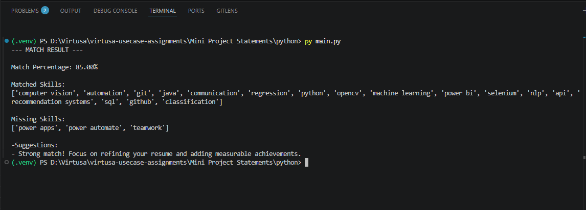

### Setup Instructions

#### Prerequisites
- Python 3.7 or higher
- pip package manager

#### Installation Steps

1. Navigate to the python project directory:
```bash
cd Mini\ Project\ Statements/python
```

2. Install required dependencies:
```bash
pip install -r requirements.txt
python -m spacy download en_core_web_sm
```

3. Place your resume in the `resumes/` folder (PDF or TXT format)

4. Place your job description in the `job_desc/` folder (TXT format)

5. Run the analyzer:
```bash
python main.py
```

#### Configuration

Edit the `main.py` file to specify your resume and job description filenames:

```python
resume_path = "resumes/your_resume.pdf"
job_desc_path = "job_desc/job_description.txt"
```

### Expected Output

The analyzer generates:
- Match percentage between resume and job description
- List of matched skills
- List of missing skills
- Personalized recommendations
- Analysis results saved to `outputs/` directory

---

## SQL Project - Hospital Management System

### Project Overview

A comprehensive PostgreSQL-based Hospital Management and Patient Analytics System. This project implements a normalized relational database for managing hospital operations including patient records, doctor information, appointments, and treatments, coupled with advanced analytical queries for business intelligence.

**Use Case:** Enables hospital administrators to maintain patient data, track medical appointments, manage treatment records, and derive actionable insights for operational improvements.

### Key Features

- Normalized relational database design with referential integrity
- Complete patient, doctor, appointment, and treatment data management
- Multi-table analytical queries using JOINs and aggregations
- Doctor performance evaluation and ranking
- Revenue analysis and trend identification
- Disease prevalence and treatment tracking
- Patient visit frequency analysis

### Technology Stack

| Technology | Purpose |
|-----------|---------|
| PostgreSQL | Relational Database Management System |
| pgAdmin | Database Administration Tool |
| SQL | Query Language and Data Analysis |

### Database Schema

#### Tables

| Table | Purpose |
|-------|---------|
| **patients** | Stores patient demographics and medical history |
| **doctors** | Maintains doctor profiles and specializations |
| **appointments** | Tracks patient-doctor interactions and schedules |
| **treatments** | Records diagnosis, procedures, and treatment costs |

#### Relationships

- One patient can have multiple appointments
- One doctor can have multiple appointments
- One patient can receive multiple treatments
- Relationships enforced through foreign keys

### Sample Query Outputs

#### Patients Table
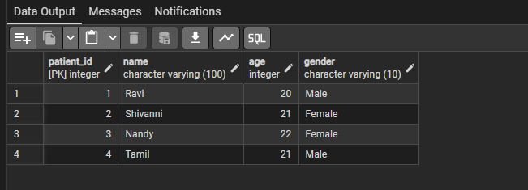

#### Doctors Table
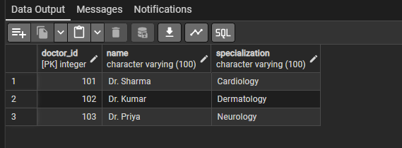

#### Appointments Table
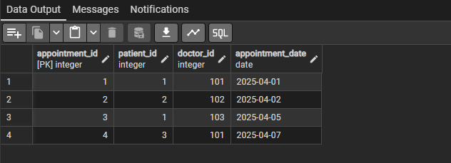

#### Treatments Table
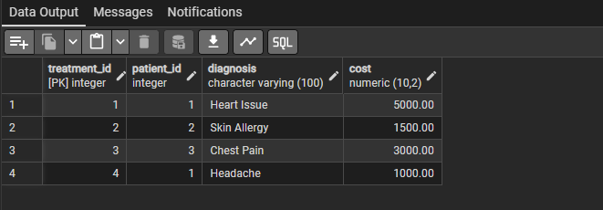

### Analytics Queries

#### Most Consulted Doctors
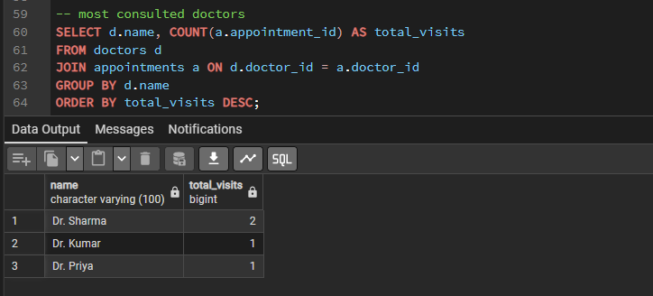

#### Doctor Performance Analysis
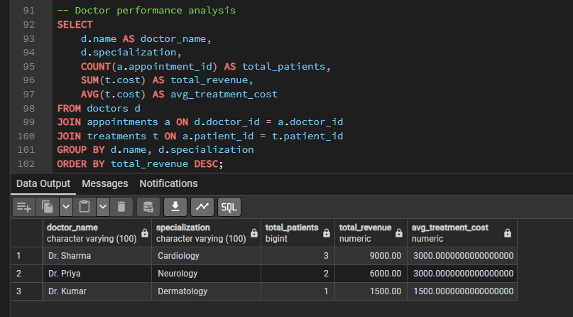

#### Monthly Revenue Analysis
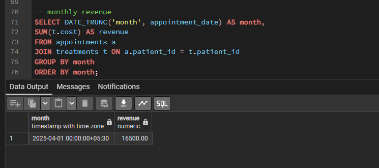

#### Total Revenue Report
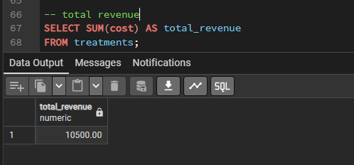

#### Common Diseases Analysis
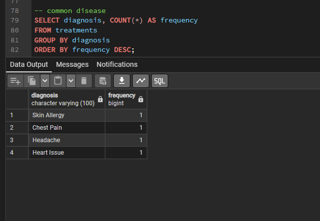

#### Patient Visit Frequency
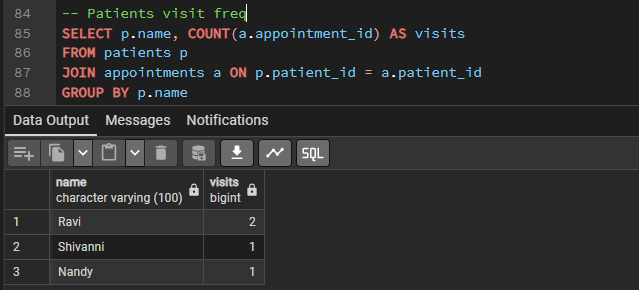

### Setup Instructions

#### Prerequisites
- PostgreSQL 12.0 or higher
- pgAdmin 4.x

#### Database Creation

1. Connect to PostgreSQL:
```bash
psql -U postgres
```

2. Create the database:
```sql
CREATE DATABASE hospital_db;
```

3. Connect to the new database:
```sql
\c hospital_db;
```

4. Execute the SQL script:
```sql
\i hospital_management_analysis.sql
```

#### Running Analytical Queries

Execute individual analytical queries after database setup:

```sql
-- Most Consulted Doctors
SELECT doctor_id, COUNT(*) as appointment_count 
FROM appointments 
GROUP BY doctor_id 
ORDER BY appointment_count DESC;

-- Total Revenue Report
SELECT SUM(treatment_cost) as total_revenue 
FROM treatments;

-- Disease Analysis
SELECT disease, COUNT(*) as frequency 
FROM treatments 
GROUP BY disease 
ORDER BY frequency DESC;
```

### Expected Output

The database setup generates:
- Four interconnected tables with sample data
- Referential integrity through foreign keys
- Sample analytical outputs in PNG format
- Comprehensive insights for hospital operations

---

### Author

**J N Ravinandan**
**SRM Vadapalani**